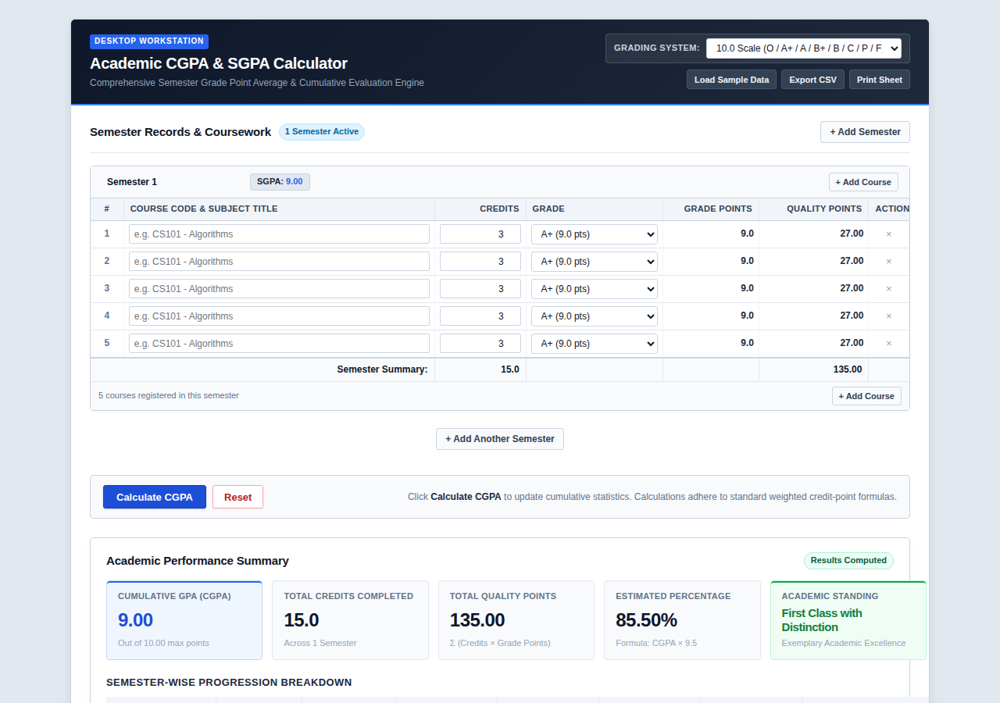

# CGPA Calculator

A CGPA and SGPA calculator for students. Add semesters, enter courses with credits and grades, and get the cumulative GPA, total credits, quality points, estimated percentage, and academic standing. Supports 10.0 and 4.0 grading scales, with CSV export and a printable summary sheet.

## Run it

No build step, no dependencies. Open `index.html` in any browser.

## Live demo

The site is static, so it can be hosted free with GitHub Pages: repo Settings > Pages > Deploy from branch > `main`. Once enabled, add the Pages URL here and as the repo website.

## Features

- Multiple semesters, each with its own course table
- 10.0 scale (O / A+ / A / B+ / B / C / P / F) and 4.0 scale support
- Semester GPA plus cumulative CGPA, quality points, and percentage estimate
- Sample data loader, CSV export, print-friendly summary sheet
